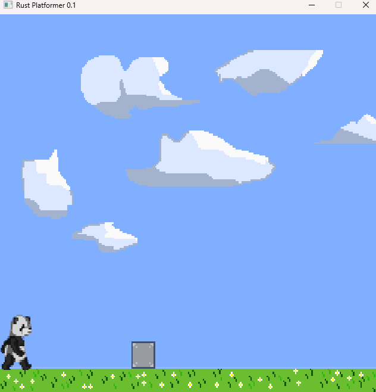

# Age of Panda

2D game programmed in Rust



## Requirements
* [Rust](https://www.rust-lang.org/tools/install)

## Cargo dependencies

* [minifb](https://crates.io/crates/minifb) - input handling
* [image](https://crates.io/crates/image) - sprite rendering
* [winit](https://docs.rs/winit) - sprite rescaling 

## Running program: Cargo

The shell script 'up' builds and runs our application by executing the following:
```
1. cargo build
2. cargo run
```